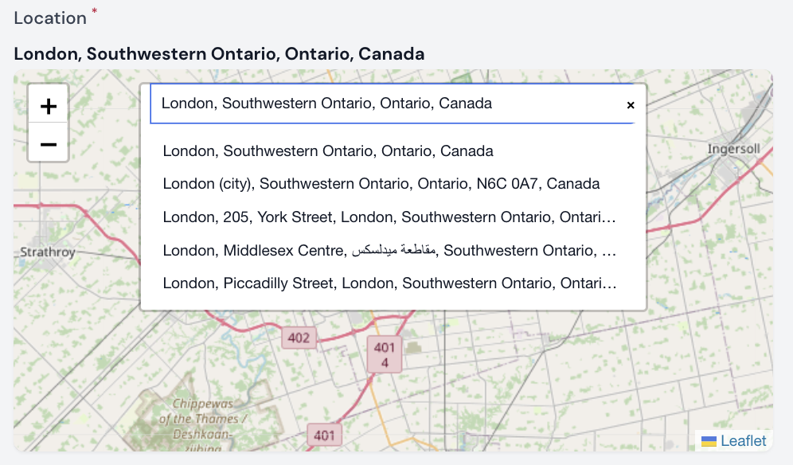

# Filament LeafLet GeoSearch

[](https://packagist.org/packages/heloufir/filament-leaflet-geosearch)
[](https://packagist.org/packages/heloufir/filament-leaflet-geosearch)

This package provides a Filament Form Field integration of the LeafLet GeoSearch package [https://github.com/smeijer/leaflet-geosearch](https://github.com/smeijer/leaflet-geosearch)




## Installation

You can install the package via composer:

```bash
composer require heloufir/filament-leaflet-geosearch
```

You need to publish assets used by this package:
```bash
php artisan vendor:publish --tag=filament-leaflet-geosearch-assets
```

## Usage
### Model configuration
In your model you need to add the location column cast:
```php
<?php

namespace App\Models;

use Illuminate\Database\Eloquent\Model;

class MyModel extends Model
{
    // ...

    protected $casts = [
        'location' => 'object'
    ];
}
```

**Important:** The `location` column must have the `longText` type in your migration (see the example below)
```php
// ...
Schema::create('my_models', function (Blueprint $table) {
    // ...
    $table->longText('location');
    // ...
});
// ...
```

### Field usage
Now that you have configured your model, you can use the `LeafletInput` into your Filament Resource form schema:

```php
use Heloufir\FilamentLeafLetGeoSearch\Forms\Components\LeafletInput;

public static function form(Form $form): Form
{
    return $form
        ->schema([
            // ...
            LeafletInput::make('location')
                ->setMapHeight(300) // Here you can specify a map height in pixels, by default the height is equal to 200
                ->setZoomControl(false) // Here you can enable/disable zoom control on the map (default: true)
                ->setScrollWheelZoom(false) // Here you can enable/disable zoom on wheel scroll (default: true)
                ->required()
            // ...
        ]);
}
```

### Good to know
The object stored into the `location` database column have the following format:

```
{
  x: Number, // lon,
  y: Number, // lat,
  label: String, // formatted address
  bounds: [
    [Number, Number], // s, w - lat, lon
    [Number, Number], // n, e - lat, lon
  ],
  raw: {}, // raw provider result
}
```

## Credits

- [heloufir](https://github.com/heloufir)
- [All Contributors](https://github.com/heloufir/filament-leaflet-geosearch/graphs/contributors)

## License

The MIT License (MIT). Please see [License File](LICENSE.md) for more information.
